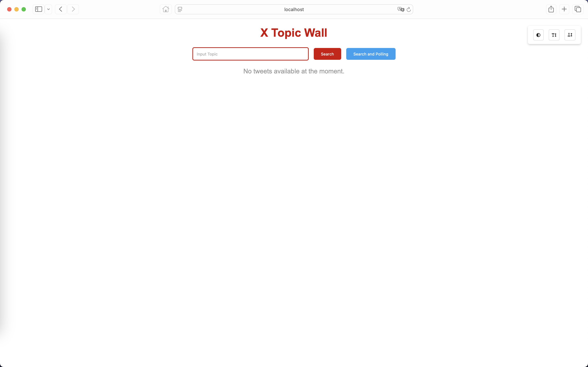
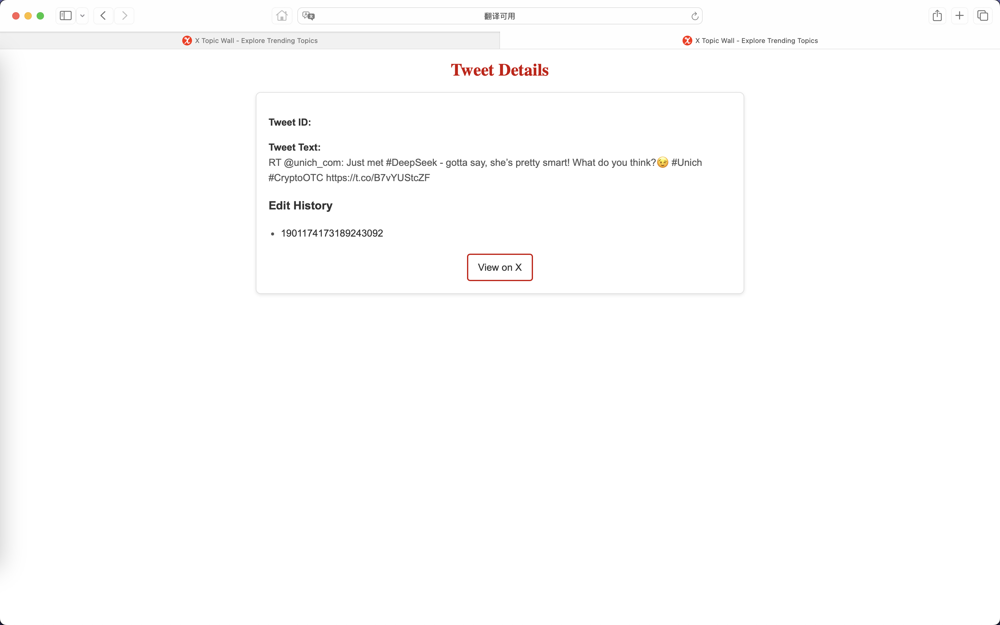

# README

## Quick Start

复制一份 `.env.example` 文件重命名为 `.env` 并填入自己的 BEARER_TOKEN

安装依赖：

```
bundle install
```

启动项目：

```
bin/rails server
```

在浏览器访问：

```
localhost:3000
```

或

```
127.0.0.1:3000
```

## 项目预览

首页：



查询页面：


详情界面：



## 项目实现

实现功能

- 搜索话题
- 轮询搜索话题
- 无障碍
- SEO 优化

通过请求 [Recent Search](https://docs.x.com/x-api/posts/recent-search) 这个 API 来实现对话题的获取，具体实现代码在 `app/services/twitter_api_service.rb` 下。

获取新推文的方式因为官方没有给出 API 所以是通过轮询的方式来实现的，每次收到请求之后重新渲染 `view/tweets/_list.html.erb` 实现获取新推文。